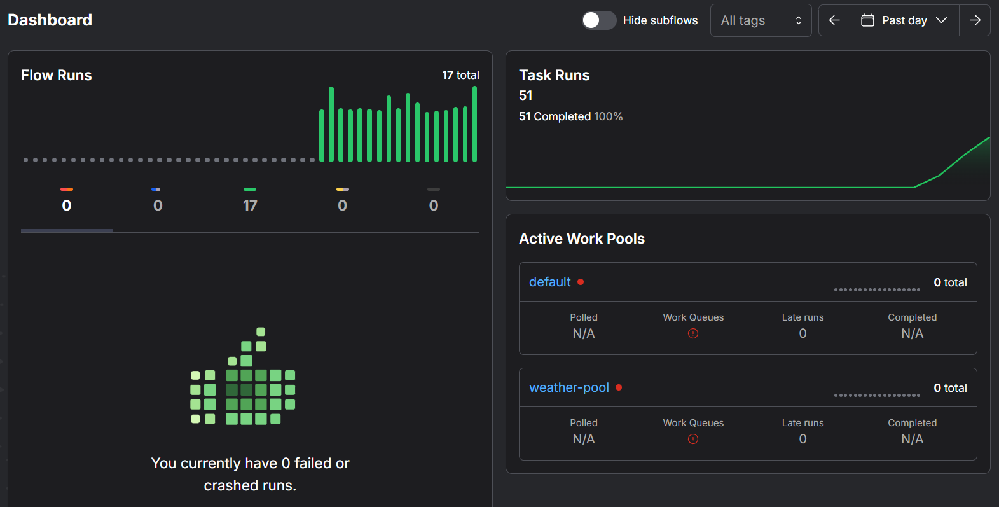
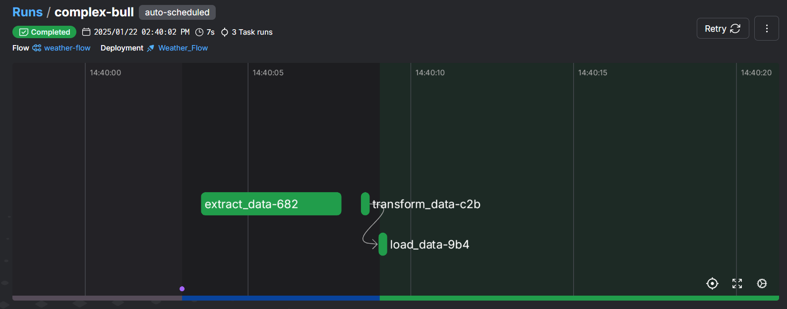
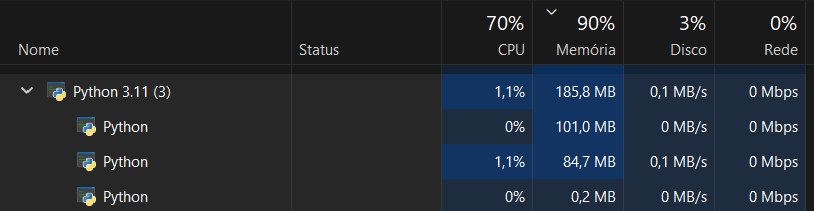

# ETL-WEATHER

Este repositório contém um projeto de Extração, Transformação e Carregamento (ETL) para dados climáticos, utilizando a API do [WeatherAPI](https://www.weatherapi.com/). O objetivo é automatizar a coleta, o processamento e o armazenamento de informações climáticas em uma base de dados, utilizando as melhores práticas de pipelines de dados.

---

## 🌟 **Objetivo**

O projeto tem como principal objetivo criar um pipeline ETL eficiente para:

- **Extrair** dados climáticos de cidades específicas.
- **Transformar** os dados em um formato padronizado e pronto para análise.
- **Carregar** os dados processados em uma base de dados para posterior uso e visualização.

---

## 🛠️ **Requisitos**

Certifique-se de que seu ambiente de desenvolvimento atende aos seguintes requisitos:

- **Python**: Versão 3.8 ou superior.
- **Gerenciador de pacotes pip**: Para instalação das dependências.
- **Bibliotecas Python**:
  - `dotenv`
  - `requests`
  - `pandas`
  - `prefect`

---

## 🚀 **Instalação**

Siga os passos abaixo para configurar o projeto localmente:

1. **Clone o repositório**:
   ```bash
   git clone https://github.com/AntonioC4r10s/ETL-WEATHER.git
   cd ETL-WEATHER
   ```

2. **Instale as dependências**:
   ```bash
   pip install -r requirements.txt
   ```

3. **Configure as variáveis de ambiente**:
   Crie um arquivo `.env` na raiz do projeto com as seguintes chaves:
   ```env
   W_API_KEY=<sua-chave-da-api>
   CITIES=paris,london,new york,tokyo,sydney
   ```

4. **Execute o pipeline ETL**:
   ```bash
   python run.py
   ```

---

## ✨ **Funcionalidades**

- **Extração**: Coleta dados climáticos em tempo real para as cidades especificadas.
- **Transformação**: Processa os dados extraídos, aplicando validações e padronizações.
- **Carregamento**: Armazena os dados processados em uma base de dados pronta para análise.

---

## 🔧 **Arquitetura do Projeto**

O pipeline ETL foi projetado de forma modular e está dividido nas seguintes etapas:

1. **Extração** (`extract.py`):
   - Coleta os dados climáticos para as cidades definidas.
   - Utiliza a API do WeatherAPI para realizar chamadas HTTP.

2. **Transformação** (`transform.py`):
   - Realiza o pré-processamento dos dados, incluindo validação e padronização.

3. **Carregamento** (`load.py`):
   - Insere os dados transformados em uma base de dados estruturada.

4. **Orquestração** (`main.py`):
   - Coordena a execução das etapas do pipeline utilizando o Prefect.

---

## 📊 **Interface Gráfica**

O projeto utiliza o Prefect para gerenciar e monitorar os pipelines ETL. Abaixo estão algumas capturas de tela que ilustram o funcionamento e a performance do sistema:

### **Dashboard do Prefect**
A interface principal do Prefect exibe o status dos fluxos de execução, facilitando o monitoramento em tempo real:


---

### **Processos em Execução**
Visualização dos processos em andamento durante a execução do pipeline, mostrando detalhes de cada tarefa:


---

### **Desempenho**
Exemplo de desempenho registrado durante a execução do pipeline, onde o consumo de memória foi de **185,8 MB**:

---

## 🛡️ **Boas Práticas Implementadas**

- Uso de variáveis de ambiente para proteger credenciais sensíveis.
- Estrutura modular, facilitando a manutenção e a escalabilidade.
- Documentação detalhada para instalação, configuração e uso.

---

## 🤝 **Contribuição**

Contribuições são muito bem-vindas! Para colaborar:

1. Faça um fork do repositório.
2. Crie uma branch para sua feature ou correção:
   ```bash
   git checkout -b minha-nova-feature
   ```
3. Envie suas alterações:
   ```bash
   git commit -m "Descrição do commit"
   git push origin minha-nova-feature
   ```
4. Abra um pull request explicando sua contribuição.

---
